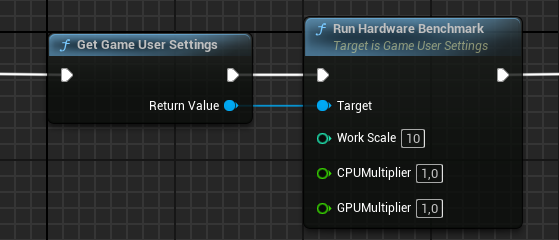
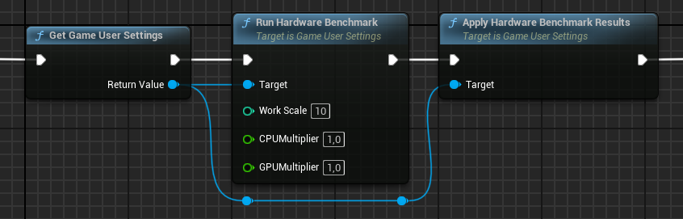

# Benchmarks and Auto-Detect Settings

## Benchmarking in Unreal

Unreal can run two benchmarks for you: One for the CPU, and the other for the GPU.
Both benchmarks will result in two numeric values, which describe the performance of the machine.
For both values, 100 describes a "standard, good" computer, though this definition varies over time.

For example, my computer is not the most modern one I could get, but reaches values of 578 (GPU) and 245 (CPU).
These results will naturally vary depending on the system load and other circumstances.

Because of this natural variation, it's best to control the environment of the test/target machine while benchmarking.
For example, a laptop might reach completely different values while running on a battery.

To run a benchmark, you can use the console command `SynthBenchmark`.
The results will be printed on the console output.
Instead of the console command, you can use the `Run Hardware Benchmark` Blueprint function:

In this screenshot, you'll notice additional parameters:

- Work Scale: Increasing this will lead to more reliable values, but the benchmarking will take longer.
  The default value works fine in most cases.
- CPU Multiplier: Use this multiplier to scale the CPU result.
- GPU Multiplier: Use this multiplier to scale the GPU result.

The multipliers are very useful to shift the meaning of a "standard, good" computer.
For example, if I want my computer to be considered a "standard, good" computer, I can use multipliers of 0.18 (GPU) and 0.45 (CPU) to get my benchmarks just over 100.

> For rough calculation, you can take the benchmark results of your definition of a "standard, good" computer.
> Then, divide 100 by these results to get the rough multiplier.
> For example, for my CPU: 100 / 245 = 0.40816.
> 
> However, always expect that you need to fine-tune these values based on real data, which you can do in a spreadsheet application, or use Scalem.

## Auto-Detect and Auto-Apply Settings

In addition to benchmarking, you need a way to apply the benchmark results.

On the console, there is a single command that runs a benchmark and applies the settings, and it's as simple as `Scalability Auto`.

In Blueprint, you can use the following nodes:

Using the knowledge you gained from reading the previous sections, it should be pretty clear that Unreal runs a benchmark to calculate the benchmark results for the CPU and the GPU.
Then Unreal compares these values against the `PerfIndexThresholds` in the `Scalability.ini` file to determine the quality level per scalability group.
In the end, the console variables for the quality levels are applied in the engine.