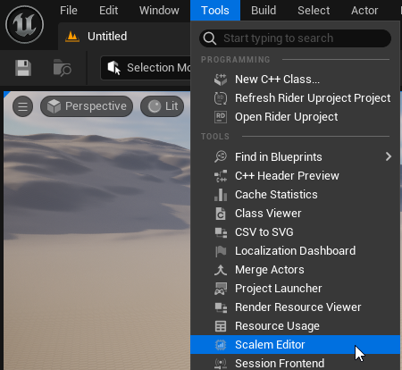
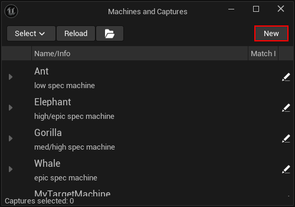
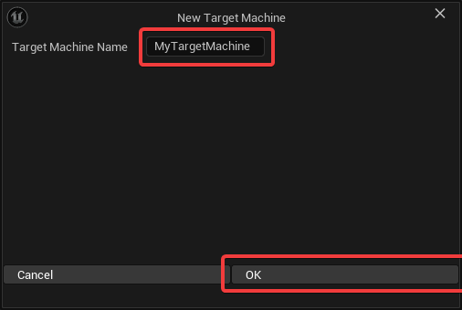
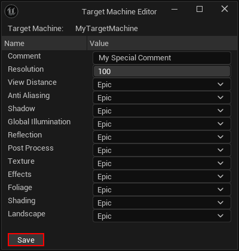
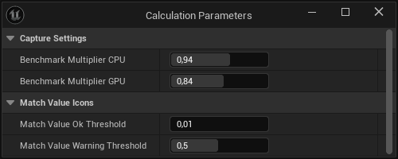
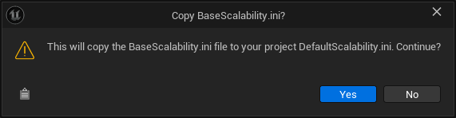

[← Previous](../Windows-in-Detail/index.md) | [Start](../../index.md) | [Next →](../../index.md)

# How to Use Scalem

To be able to use Scalem, we need to take a look at multiple different routines, which can be put into two separate categories: _Setup_ and _Loop_.
The _Setup_ routines are routines you only need to do once, or a few times.
The _Loop_ routines will be used regularly, and you'll probably spend most time in them.

> I try to describe a simple process here, but in reality, your individual process will probably look different.

> If you feel that some important info is missing here, take a look at the [Windows in Detail](../Windows-in-Detail/index.md), which sometimes has more detailed information about the usage of the individual windows.

To open the Scalem Editor window, navigate to `Tools` → `Scalem Editor`:

## Setup Routines

### Setting up Target Machines

Each target machine needs to be set up before you can add captures to it.
However, it is possible to first make the captures, then create the target machine.

You should make the specifics of each target machine clear for youself and your team.
This commonly includes not only the scalability settings (Low, Medium, High, Epic), but also the target framerate and other specifics.

To create a new target machine, hit the `New` button in the _Machines and Captures_ window:

Then, give the new target machine a name:

To finish setting up the target machine, fill in the details and an optional comment, then hit save:

### Setting up Calculation Parameters

The calculation parameters will be stored in the `DefaultEngine.ini` file of the project.
The settings contain values such as:

- Benchmark CPU and GPU Multipliers
- Thresholds for warning indicators ("match values")

> These settings will be applied immediately after changing!

This window can be opened by using the `Window` menu in the _Scalem Editor_.

### Creating new `Scalability.ini` preset files

Right now, there's no way to create a new preset file using the UI.
You can however copy an existing preset file, or the `BaseScalability.ini` file, and place it in the `(Unreal Project)/Scalem/Presets` folder.

### Creating a `DefaultScalability.ini` file

Even if the `DefaultScalability.ini` file does _not_ exist, it still appears in the selection list.
If you want to create it, you can select it and confirm the prompt.
This will copy the `BaseScalability.ini` file that's shipped with Unreal and place it into the correct location.

## Loop Routines

In rough order:

### 1. Package and Distribute the Project

With the plugin enabled, package your project using the `Development` configuration.
Copy that project over to the target machine you want to test on, then run it.

> Note: The `Development` configuration is only needed if you want to use a console command to capture scalability data.

### 2. Adjust the Performance on the Target Machine

Use various techniques to adjust the quality settings to achieve what you defined for the target machine.
This can be done by setting the scalability groups to a specific quality, or by setting scalability CVars individually, or a mixture of both.
Note that currently the scalability group setting can only be compared to the same `Scalability.ini` file configuration, while CVar overrides provide a clear, absolute value.

If your quality settings menu uses scalability groups, you can also use it to balance quality and performance.

> Note that this definition can vary. While you might want to maintain stable 60+ fps on one machine, 30+ fps could be enough for another machine. Look at your definition!

To find the best settings for that target machine, it's sometimes necessary to play through longer (and different) sections of the game.
Keep that in mind.

### 3. Create a Scalability Capture

When you're satisfied with the quality settings and the performance, you can use the `Scalem.Write` command to dump the configuration to a file.

The command takes all the parameters as a comment, so you can keep apart multiple captures.

> Note that Scalem uses the computer name as the target machine name.
> You can manually adjust the name in the captured file using a standard text editor.

As a last step, copy that file (`(Unreal Project)/Scalem/....ini`) to your project's `Scalem` folder.

> Scalem is designed so that you can include a capture/report button in your menu and ask playtesters to do that process for you.
> It is up to you to manage playtesters and provide them with information about this.

### 4. Adjust the `Scalability.ini` using the Editor

After opening the Scalem Editor (`Tools` → `Scalem Editor`) most windows will be empty:

- The _Scalability Editor_ window should have no file selected, or `(DefaultScalability)`.
- The _Machines and Captures_ window will show all the target machines and their captures, or nothing if none could be found.
- All the other windows depend on the selection of either scalability captures or a scalability preset.

#### Selecting a Scalability Preset

Using the _Scalability Editor_, you can select a scalability preset and make it active.
This will automatically put the bar plot window into the "compare to auto" mode and activate the visual scalability editor, as well as the Scalability Editor window itself.

To get back to "compare to target" mode, use the "Select None" button.

<video controls autoplay loop muted>
<source src="../Media/Select_Scalability.mp4">
</video>

#### Adding Scalability Captures to the Overview

Using the _Machines and Captures_ window, you can look at all scalability captures and activate them.
Activated captures will be added to the calculation and to the bar plot, as well as to the _Visual Scalability Editor_ as little, colored dots.

<!--<video controls autoplay loop muted>
<source src="../Media/Select_Captures.mp4">
</video-->

<video controls autoplay loop muted>
<source src="../Media/Select_Captures_Live.mp4">
</video>

#### Editing the Scalability Preset

To adjust the scalability group thresholds, you can use two different methods:

- Adjust the value in the table (_Scalability Editor_). You can click and enter a number, or click-drag to change the number directly.
- Move the white handles in the _Visual Scalability Editor_.

<video controls autoplay loop muted>
<source src="../Media/Live_Editing.mp4">
</video>

The second way can be the preferred way, as you can also see the benchmark values and the target for the selected scalability captures and their target machines.

Both methods run the calculation to adjust the bar plot and the performance indicators (_Machines and Captures_).

When you're happy with the changes, you can click the "Save" icon in the _Scalability Editor_ to save the `Scalability.ini` preset file (or the `DefaultScalability.ini` file, if selected).

**If you're not editing the `DefaultScalability.ini` file, the selected preset will only be saved, but never applied.**
This can be useful for comparison purposes, as well as to communicate changes with your team, but otherwise it has no technical impact on your product.

To overwrite the `DefaultScalability.ini` file with your _selected_ preset, you can click the "Make Default" button in the _Scalability Editor_.

#### Adjust CVars per Scalability Group

In the _Scalability Editor_, you can use the little pencil icons to open a CVar editor window for that specific scalability group and quality.
In that window, you can add and adjust the values as you like.

<video controls autoplay loop muted>
<source src="../Media/Edit_CVars.mp4">
</video>

#### Selecting Scalability Captures

Using the _Machines and Captures_ window, you can select captures to add them to the calculation and the bar plot.

### 5. Test and Repeat

After adjusting the `Scalability.ini` file (as well as benchmark multipliers), you can test these settings and start again at step 1.

---

## Developer Notes

_Scalem_ tries to be as self-contained as possible.
However, some functionality is just useful to have, so I exposed them as API functions.

In general, the only runtime module (`ScalemRuntime`) tries to be as small as possible, only containing what's absolutely needed.

### Exposed Blueprint Functions

- `UScalemBPRuntimeLibrary::GetCPUBenchmarkMultiplier()`
- `UScalemBPRuntimeLibrary::GetGPUBenchmarkMultiplier()`
  - These functions return the same benchmark multipliers that are used for the calculation.
    When using Unreal's benchmarking functionality to automatically apply the settings based on the `Scalability.ini` file, you can use these functions to get the exact same multipliers.

[Next →](../../index.md)