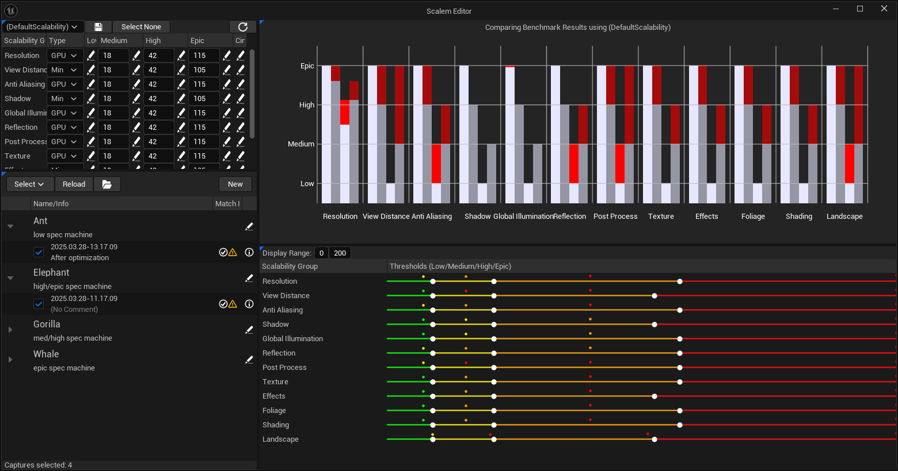

[← Previous](../Introduction/index.md) | [Start](../../index.md) | [Next →](../Windows-in-Detail/index.md)

# Scalem Window Overview

The main window for Scalem can be found in `Tools` &rarr; `Scalem Editor`.
The window contains multiple subwindows, some of which open automatically:

- [Scalability Editor](../Windows-in-Detail/index.md#scalability-editor)
- [Visual Scalability Editor](../Windows-in-Detail/index.md#visual-scalability-editor)
- [Console Variables Editor](../Windows-in-Detail/index.md#console-variables-editor)
- [Machines and Captures](../Windows-in-Detail/index.md#machines-and-captures)
- [Bar Plot](../Windows-in-Detail/index.md#bar-plot)
- [Calculation Parameters](../Windows-in-Detail/index.md#calculation-parameters)
- [Target Machine Editor](../Windows-in-Detail/index.md#target-machine-editor)
- [Scalability Capture Viewer](../Windows-in-Detail/index.md#scalability-capture-viewer)

The following sections will go through these individual windows in more detail.

## Main Window

The main window as it opens by default is split horizontally into two separate sides:

The left side can be thought of as the list and selection side.
It contains the window for selecting the scalability bundle and adjusting that (top).
The bottom window lists all your target machines and their scalability captures.
The scalability captures can be selected and show statistics about how they perform compared to their target and using the currently selected scalability bundle.

The right side is the "visual" side.
It contains the bar plot (top), which shows the performance of the selected scalability captures in detail.
The bottom window allows you to adjust the currently selected scalability bundle using sliders per scalability group.
It also draws the currently selected scalability bundles to make it easier to place the slider in the best spot.

> One of the biggest strengths of Scalem is that all the calculation is happening live, while editing.
> For example, when adjusting the sliders, you can see how all the data visualization changes to reflect these new values.
> This makes it easy to set up the scalability considering all your target machines.

The remaining windows only appear after summoning them manually using the `Window` menu, or after certain actions happen.

[Next →](../Windows-in-Detail/index.md)
