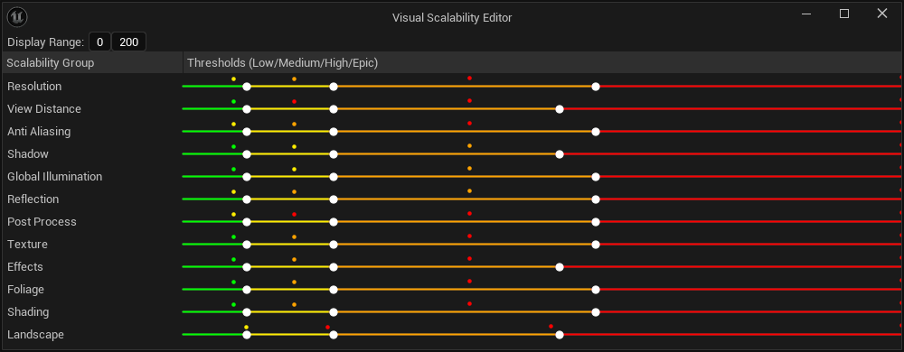
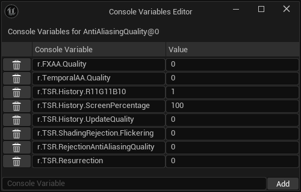
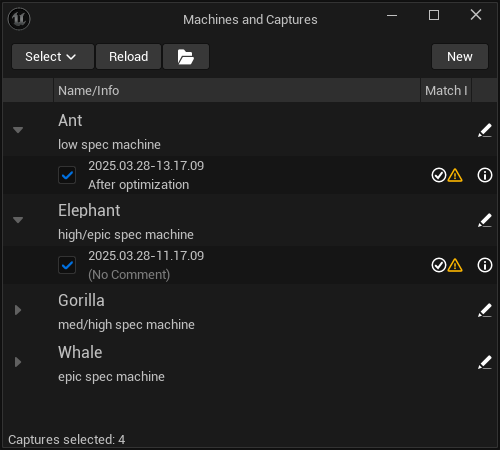
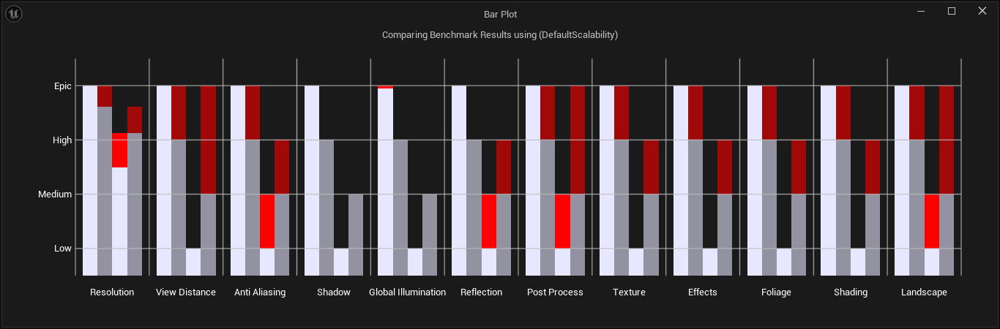
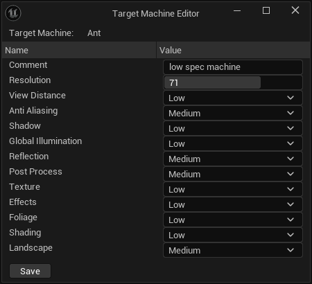

[Start](../index.md) | [Previous](Window-Overview.md) | [Next](How-to-Use.md)

# Scalem Windows in Detail

This document shows all Scalem windows in more detail and describes their interaction.
After reading this page, you should have a good idea about how to use Scalem.

## Scalability Editor

This editor lets you set up the quality level performance thresholds for all scalability groups.
One row per scalability group, it displays the `PerfIndexThreshold` fields and buttons for editing the console variables for each combination of a scalability group and the quality levels (see [Console Variables Editor](#console-variables-editor)).

After editing the scalability, you can save the selected bundle by clicking the "Save" button.

If you want to save the selected preset as the new `DefaultScalability.ini` file, you can click the "Set" button.

The scalability editor also provides the functionality to select the "current" scalability bundle from a list of existing presets and the default scalability.
This selection affects all the other Scalem windows.

## Visual Scalability Editor

The visual scalability editor provides another way to edit the `PerfIndexThresholds` values for the currently selected scalability bundle.
For each scalability group, it provides a "multi slider" with three individual sliders which you can move around to set the threshold values.

To make your life even easier, it also plots the benchmark values and the target values of the selected scalability captures as small colored dots.
The space between the slider handles is also colored accordingly, making it easy to match the thresholds visually.

The colors mean:

- Green: Low quality
- Yellow: Medium quality
- Orange: High quality
- Red: Epic quality

In the top bar, you can adjust the visualized range.

## Console Variables Editor

The console variables editor allows you to edit the CVars for the clicked scalability group at the specific quality level (see [Scalability Editor](#scalability-editor)).

Besides adjusting existing values, you can also add a new console variable or delete existing ones.

The "Value" field is a string of characters, allowing you to also add inline comments to the `.ini` file.

## Machines and Captures

This editor lists all the loaded target machines and their captures.
It allows you to select the captures you want to look at in more detail.

In addition to this, it allows you to edit the details for target machines, and view the details for scalability captures.
Both of these features spawn new windows (see [Target Machine](#target-machine-editor) and [Scalability Capture Viewer](#scalability-capture-viewer)).

Each scalability capture row also shows indicators of their performance compared to the target performance of their target machine.
If a scalability bundle is selected, a second indicator will show the performance applied to the target machine based on the benchmark values of that capture.

The menu bar of that window shows buttons:

- Select: Instead of manually selecting scalability captures, you can select captures using these predefined filters.
- Reload: Reload the target machines.
- Open Folder: Navigate to the Scalem folder using the file explorer.
- New: Create a new target machine.
  This will ask for the new target machine name, and then open the [Target Machine Editor](#target-machine-editor) for the newly created target machine.

## Bar Plot

The bar plot visualizes your selected scalability captures.
On the horizontal axis, it lists all the scalability groups, the vertical axis shows the different quality levels.
_Resolution Quality_ is an exception to this, as it's not directly using quality levels, but the screen percentage instead.

Hovering over bars shows additional details.

The bar plot visualization has two different modi, which can be selected at the top:

- Compare to Target:
  Compares the scalability capture to the target scalability as set in the target machine details.
  This is useful if you want to see how closely the capture matches the actual goal for its target machine.
- Compare to Auto:
  Compares the scalability capture to the automatic quality levels its target machine would be assigned to if Unreal follows the selected scalability bundle based on the benchmark values of the scalability capture.

Each bar is vertically split into two separate areas: the solid part, and a colored part.
Depending on the situation, the colored part is red ("bad") or green ("good").
Each bar shows the setting actually achieved in the scalability capture, compared to the performance that we wanted to achieve/would achieve, depending on the selected mode.

> Note that "bad" and "good" are relative terms, as it can be interpreted as "good quality" or "good performance."

The bar plot&mdash;as all the other windows&mdash;update automatically, so it's easy to tweak the important values while watching the colors change.

## Calculation Parameters

The calculation parameters editor lists all calculation parameters and allows you to edit them.
These parameters are used for many different purposes.

A future version of this document will go into more detail, as this part of the tool is still under heavy development.

## Target Machine Editor

This window will be summoned by clicking the specific button in the [Machines and Captures](#machines-and-captures) window.

It allows you to edit all important values for the specified target machine.

> **Note:** It is currently _not_ possible to change the name of a target machine using the GUI.
> It is possible to rename a target machine by manually editing the `.ini` files (target machine _and_ the captures) and reopening the editor.
> If you do that, I recommend that you also rename the files to reflect that change.

## Scalability Capture Viewer

The scalability capture viewer is summoned by clicking the specific button in the [Machines and Captures](#machines-and-captures) window.

It shows all the data of the specified scalability capture.
There is no editing functionality.

> It is possible to manually edit the `.ini` files directly.

[Next &rarr;](How-to-Use.md)
